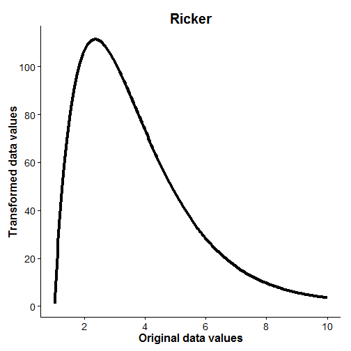
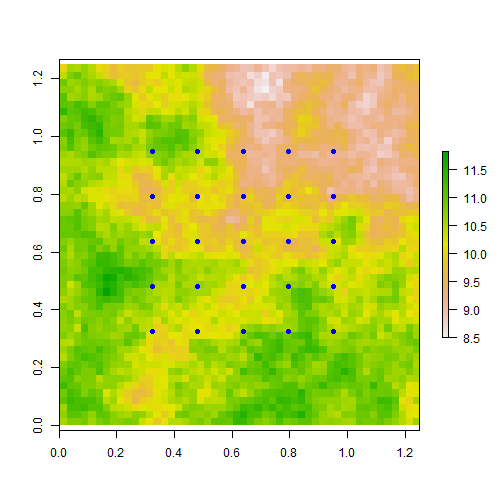
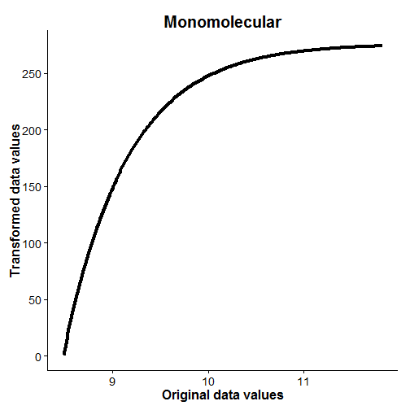
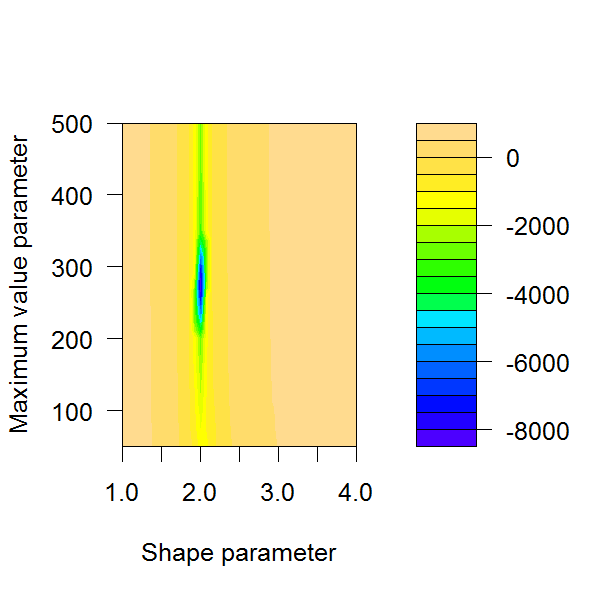
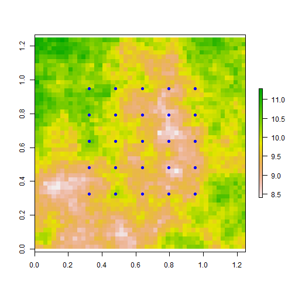
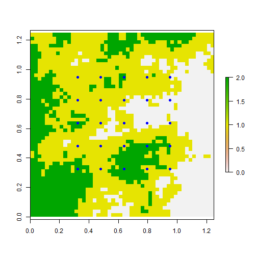
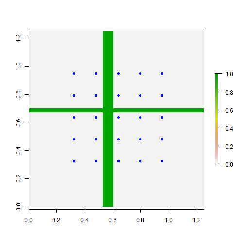
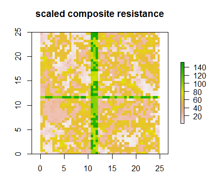
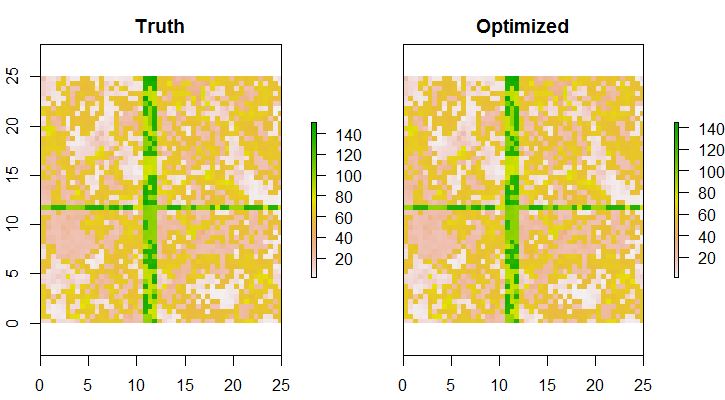
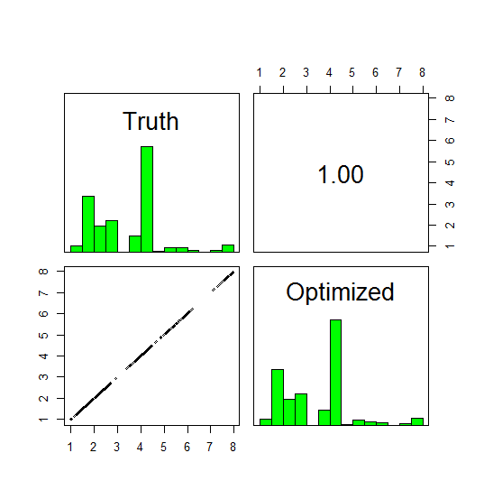

<!--
%\VignetteEngine{knitr::knitr}
%\VignetteIndexEntry{A Vignette/Tutorial to use ResistanceGA}
-->


ResistanceGA
=====
An R Package for Optimizing Resistance Surfaces using Genetic Algorithms
------
### Background

With this vignette/tutorial, hopefully you'll get an idea of what each of the functions in this package can do, as well present an example (using simulated data) of how you can optimize resistance surfaces in isolation as well as simultaneously to create novel resistance surfaces. This 'package' (I use that term very loosely) has largely been developed from functions I wrote to conduct different landscape genetic analyses. See [Peterman et al. (2014)](http://onlinelibrary.wiley.com/doi/10.1111/mec.12747/abstract "Published Molecular Ecology Study") for the original conception of optimizing resistance surfaces using optimization functions. This approach was limited to optimization of continuous surfaces in isolation. Since that paper, I've further developed the optimization method to utilize genetic algorithms, implemented using the `ga` function from the [GA package](http://cran.r-project.org/web/packages/GA/index.html "GA package, CRAN") in R. By moving to genetic algorithms, much more complex parameter space can be effectively searched, which allows for the optimization of categorical resistance surfaces, as well as optimization of multiple resistance surfaces simultaneously. 


This package fills a void in the landscape genetics toolbox. There are various methods proposed for determining resistance values (reviewed by [Spear et al., 2010](http://onlinelibrary.wiley.com/doi/10.1111/j.1365-294X.2010.04657.x/abstract "Spear et al.")). Previously utilized methods generally searched a limited parameter space and/or relied on expert opinion. [Graves et al. (2013)](http://onlinelibrary.wiley.com/doi/10.1111/mec.12348/abstract "Graves et al.") utilized optimization functions and interindividual genetic distances to determine resistance values, but found that the data generating values were rarely recoverable. I have not assessed the ability of functions/methods utilized in this package to optimize resistance surfaces as in Graves et al. (2013), but do note that very different methods of scaling, transforming, and combining resistance surfaces are utilized in `ResistanceGA`.


A few words of caution. I have made every effort to run and test each function with simulated data, but I make no guarantees concerning function performance and stability. Data formatting can be a challenge, and I have tried to simplify the process as much as possible. Please make sure you carefully read through the [CIRCUITSCAPE](http://www.circuitscape.org/home "CIRCUITSCAPE") documentation, as well as other relevant papers by [Brad McCrae](http://www.circuitscape.org/pubs "McCrae papers") to get a more complete understanding of resistance modeling and circuit theory. If errors occur, start by making sure that you are providing function inputs in the correct format. If a function does not work, there likely will not be a helpful error message to help you troubleshoot. Depending on interest and use, these are features that may be added in the future. Lastly, this is not a fast process. Even with the 50x50 pixel simulated landscapes used in this tutorial, each optimization iteration takes 0.75--1.00 seconds to complete (Intel i7 3.4 GHz processor, 24 GB RAM). The largest surfaces I've attempted to optimize using these methods were 600x600 pixels, which took ~13 seconds per iteration. It appears that under most circumstances the resolution of the landscape can be reduced without loss of information. If you want to use the optimization procedures in `ResistanceGA`, but are working with a large landscape, I might suggest reducing the resolution first. Depending upon whether you are optimizing a single surface or multiple surfaces simultaneously, the genetic algorithms typically run for 50--300 generations. `ga` settings will vary for each run, but there will typically be 50--150 offspring (i.e. different parameter value realizations) per generation. This means that 2500--4.5 &times; 10<sup>4</sup> iterations will be needed to complete the optimization. This can be a **LONG** process! If you encounter issues while executing any of these functions, or would like some other functionality incorporated, please let me know (<bill.peterman@gmail.com>). I am eager to make this as accessible, functional, and as useful as possible, so any and all feedback is appreciated.


**References**   
* Graves, T. A., P. Beier, and J. A. Royle. 2013. Current approaches using genetic distances produce poor estimates of landscape resistance to           &nbsp;&nbsp;&nbsp;&nbsp;&nbsp;interindividual dispersal. Molecular Ecology 22:3888--3903.
* Peterman, W. E., G. M. Connette, R. D. Semlitsch, and L. S. Eggert. in press. Ecological resistance surfaces predict fine scale genetic     
&nbsp;&nbsp;&nbsp;&nbsp;&nbsp;differentiation in a terrestrial woodland salamander. Molecular Ecology 23:2402--2413.    
* Spear, S. F., N. Balkenhol, M. J. Fortin, B. H. McRae, and K. Scribner. 2010. Use of resistance surfaces for landscape genetic studies:     
&nbsp;&nbsp;&nbsp;&nbsp;&nbsp;considerations for parameterization and analysis. Molecular Ecology 19:3576--3591.


Setup
------
### Install necessary software and packages
This package requires that you have [CIRCUITSCAPE v4.0](http://www.circuitscape.org/downloads "CS Downloads") or higher installed on your Windows machine. You will also need to have [R v3.03](http://www.r-project.org/ "R downloads") or higher installed. I would highly recommend installing [R studio](https://www.rstudio.com/ide/download/ "R Studio download") when working with R.

*R Packages*    
This package consists of several wrapper functions for implementing functions from other packages, as well pulling together and summarizing results. Necessary packages are: `lme4`, `raster`, `ggplot2`,`plyr`, and `GA`. If you want to simulate resistance surfaces and/or generate response surfaces of single continuous surfaces (as done in this tutorial), you will also need `RandomFields` and `akima`.


Demonstrations
------
### Continuous surface transformations

Load the required R packages, clear your workspace, and set a random number seed. The `RandomFields` package will be used to simulate resistance surfaces. The `akima` package is needed to interpolate response grids.  The `ResistanceGA` package requires the `raster`, `plyr`, `GA`, `lme4` (>= 1.0), and `ggplot2` packages.

```r
require(RandomFields)
require(ResistanceGA)

rm(list = ls())
```


There are 8 different transformations that can be applied to continuous surfaces. Since the publication of Peterman et al. (2014), I have added Reverse Ricker and Inverse-Reverse Ricker transformation to better cover parameter space. I still think that there are better, more flexible ways to optimize surfaces, and I'm continuing to develop these as I have time.   


All of these figures were made with the `PLOT.trans` function. This function returns a ggplot object, which allows you to manipulate some aspects of the plot, as well as determine the resistance value at different levels of your original surface.

```r
Ricker.plot <- PLOT.trans(PARM = c(1.5, 200), Resistance = c(1, 10), transformation = "Ricker")
```

 

```r

# Change title of plot
Ricker.plot$labels$title <- "Ricker Tansformation"
Ricker.plot
```

 

```r

# Find original data value that now has maximum resistance
Ricker.plot$data$original[which(Ricker.plot$data$transformed == max(Ricker.plot$data$transformed))]
```

```
## [1] 2.357
```


Example Function Use
------
### Single surface optimization

**Simulate data**


Make a directory to write ASCII files, CIRCUITSCAPE batch files, and results. 

```r
if ("ResistanceGA_Examples" %in% dir("C:/") == FALSE) dir.create(file.path("C:/", 
    "ResistanceGA_Examples"))

# Create a subdirectory for the first example
dir.create(file.path("C:/ResistanceGA_Examples/", "SingleSurface"))

write.dir <- "C:/ResistanceGA_Examples/SingleSurface/"  # Directory to write .asc files and results
```


Define the data simulation parameters:

```r
r.dim <- 50  # number of cells on a side
cell.size <- 0.025  # raster cell dimension     
min.point <- 0.25 * (r.dim * cell.size)  # minimum coordinate for generating random points (multiplied by 0.25 to prevent edge effects)
max.point <- (r.dim * cell.size) - min.point  # maximum coordinate for generating random points

# Number of 'Sample locations' to generate. This example will generate
# points on a square grid, so choose a number that has an even square root
n <- 25
x <- seq(from = min.point, max.point, length.out = 5) + (cell.size/2)  # set x & y locations for points
y <- seq(from = min.point, max.point, length.out = 5) + (cell.size/2)
Sample.points <- expand.grid(x, y)

Sample.coord <- SpatialPoints(Sample.points)
coord.id <- cbind((1:n), Sample.coord@coords)  # Combine location ID with coordinates

# Write the table to a file. This is formatted for input into CIRCUITSCAPE
write.table(coord.id, file = paste0(write.dir, "samples.txt"), sep = "\t", col.names = F, 
    row.names = F)
```


Using random fields, create one continuous resistance surface

```r
set.seed(12345)
model <- RMexp() + RMtrend(mean = 10)

grid.vars <- GridTopology(cellcentre.offset = c(cell.size/2, cell.size/2), cellsize = c(cell.size, 
    cell.size), cells.dim = rep(r.dim, 2))

rf.sim <- RFsimulate(model, x = grid.vars)

cont.rf <- raster(rf.sim[1])  # Define object as a continuous raster surface
names(cont.rf) <- "cont"
```


Plot surface and overlay the sample points

```r
plot(cont.rf)
plot(Sample.coord, pch = 16, col = "blue", add = TRUE)  # Add points
```

 


Export the raw continuous surface to a .asc file for use with CIRCUITSCAPE

```r
writeRaster(cont.rf, filename = paste0(write.dir, "cont.asc"), overwrite = TRUE)
```


## Prepare data for optimization   
Run the `GA.prep` and `CS.prep` functions

```r
# Set the random number seed to reproduce the results presented
GA.inputs <- GA.prep(ASCII.dir = write.dir, min.cat = 0, max.cat = 500, max.cont = 500, 
    seed = 99)

CS.inputs <- CS.prep(n.POPS = n, CS_Point.File = paste0(write.dir, "samples.txt"), 
    CS.exe = paste("\"C:/Program Files/Circuitscape/4.0/cs_run.exe\""))
```

Note that `RESPONSE` was not defined in `CS.prep` because it has not been made yet.

Transform raw continuous surface using the `Resistance.tran` function to apply one of the eight transformations, and then view the transformation using `PLOT.trans`. Note that `PLOT.trans` returns a `ggplot2` object as well as the plot. Therefore you can manipulate and modify the plot as desired.

```r
r.tran <- Resistance.tran(transformation = "Monomolecular", shape = 2, max = 275, 
    r = cont.rf)

plot.t <- PLOT.trans(PARM = c(2, 275), Resistance = "C:/ResistanceGA_Examples/SingleSurface/cont.asc", 
    transformation = "Monomolecular")
```

 


Run the transformed resistance surface through CIRCUITSCAPE to get effective resistance between each pair of points. `Run.CS` returns the lower half of the pairwise resistance matrix for use with the optimization prep functions. This will be our response that we optimize on.


Rerun `CS.prep` including the newly created `CS.Response`

```r
CS.inputs <- CS.prep(n.POPS = n, RESPONSE = CS.response, CS_Point.File = paste0(write.dir, 
    "samples.txt"), CS.exe = paste("\"C:/Program Files/Circuitscape/4.0/cs_run.exe\""))
```


Run the Single surface optimization function (`SS_optim`). Running this example with the default settings
took 176 iterations and ~75 minutes to complete on a computer with an Intel i7 3.4 GHz processor. This is longer than the average single surface optimization generally takes, but as you can see below, we very precisely recovered the data generating values.   

```r
SS_RESULTS <- SS_optim(CS.inputs = CS.inputs, GA.inputs = GA.inputs)
```

After executing the function, the console will be updated to report the time to complete each iteration as well as AICc of each iteration. If you do not wish to view updates at each iteration of the optimization, set `quiet = TRUE` in `GAp.prep`

What the `SS_optim` function does:       
* Read each .asc file that is in the specified ASCII.dir and determines whether it is a categorical or continuous surface. A surface is considered categorical if it contains 15 or fewer unique values.   
* Optimize each resistance surface   
 * Categorical surfaces: The first category/factor is set to a resistance value of 1. All other categories are then adjusted, ranging from the minimum--maximum specified during the `GA.prep`. It is necessary to fix the value of one category, otherwise numerous equivalent solutions may make optimization intractable (e.g. resistance values of 1, 5, & 10 would have the same relative resistance as 2, 10, & 20)   
 * Continuous surfaces: Each continuous surface is first rescaled so that values range from 0--10 (note that the relative differences are preserved during rescaling). The genetic algorithm then tests different combinations of transformation equation, shape parameter value, and maximum resistance value. When the genetic algorithm has finished optimization, the optimized parameters can be passed to a second optimization function that uses `nlm` to fine-tune the shape and maximum value parameters (`nlm = TRUE`). However, this approach may lead to overfitting and the default is `nlm = FALSE`.   
* Several summary outputs are generated   
 * In the 'Results' directory (located in the directory with the .asc files), a final optimized resistance .asc file has been made, along with the CIRCUITSCAPE results (.out files).   
 * Summary tables for continuous surfaces (ContinuousResults.csv), categorical surfaces (CategoricalResults.csv), and the AICc of all surfaces (All_Results_AICc.csv)   
 * MLPE_coeff_Table.csv contains the model coefficients from the fitted mixed effects model for each surface   
 * In the 'Plots' directory there is a 4-panel figure with different model diagnostic plots generated from the fitted mixed effects model of each optimized resistance surface. If a continuous surface was optimized, there is also a plot showing the relationship of the transformed resistance surface with the original data.   
* The returned object is a named list containing the tables described above.   
  
 
Following a complete long run of the optimization algorithm, we can inspect the results of the single surface optimization and see that we have recovered the data generating parameters (see below for comments):
```
SS_RESULTS$ContinuousResults

  Surface     AICc      Equation     shape        max
1    cont -9104.067  Monomolecular     2       275.0041
```

To view the AICc response surface for the Monomolecular optimization of this surface, you can run `Grid.Search`. This function is only relevant for single continuous surfaces.

```r
Grid.Results <- Grid.Search(shape = seq(1, 4, by = 0.1), max = seq(50, 500, 
    by = 75), transformation = "Monomolecular", Resistance = cont.rf, CS.inputs)
```

      
Note that actual response surfaces tend to be slightly flatter, and the maximum value for a single surface is more difficult to identify precisely. If you were to add some random noise to the CS.response (perhaps more realistic of 'noisy' genetic data), the single surface optimization generally would do a good job of recovering the transformation and shape parameters, but the true maximum value may remain elusive. Also, despite setting random number seeds, there appears to be some variation from run to run. Regardless, the algorithm generally recovers the data generating parameters. Occasionally the algorithm will get 'stuck' trying to optimize on an incorrect transformation. If this happens, rerun the optimization. Of course, you may not know that a surface wasn't correctly optimized when using real data. For this reason, it may be good practice to run all optimizations at least twice to confirm parameter estimates.       

 ****
### Simultaneous optimization of multiple surfaces

**Simulate data**

First, make a new directory to write ASCII files, CIRCUITSCAPE batch files, and results.

```r
set.seed(321)
if ("ResistanceGA_Examples" %in% dir("C:/") == FALSE) dir.create(file.path("C:/", 
    "ResistanceGA_Examples"))

# Create a subdirectory for the second example
dir.create(file.path("C:/ResistanceGA_Examples/", "MultipleSurfaces"))

write.dir <- "C:/ResistanceGA_Examples/MultipleSurfaces/"  # Directory to write .asc files and results
```


Simulate two more continuous surfaces. The first will remain continuous, the second will be converted into a 3-class categorical surface

```r
rf.sim <- RFsimulate(model, x = grid.vars, n = 2)  # Create two surfaces

cont.rf <- raster(rf.sim[1])  # Define first as a continuous surface
names(cont.rf) <- "cont"

plot(cont.rf)
plot(Sample.coord, pch = 16, col = "blue", add = TRUE)
```

 

```r

cat.rf <- raster(rf.sim[2])
names(cat.rf) <- "cat"
cat.cut <- summary(cat.rf)  # Define quartiles, use these to define categories

cat.rf[cat.rf <= cat.cut[2]] <- 0
cat.rf[cat.rf > 0 & cat.rf <= cat.cut[4]] <- 1
cat.rf[!cat.rf %in% c(0, 1)] <- 2
plot(cat.rf)
plot(Sample.coord, pch = 16, col = "blue", add = TRUE)
```

 


Now make a categorical feature class (like a road)

```r
feature <- matrix(0, r.dim, r.dim)
feature[23, ] <- 1
feature[, 22:24] <- 1
feature <- raster(feature)
extent(feature) <- extent(cat.rf)
plot(feature)
names(feature) <- "feature"
plot(feature)
plot(Sample.coord, pch = 16, col = "blue", add = TRUE)
```

 


Write all three surfaces to a directory for use with CIRCUITSCAPE and run the `GA.prep` function (needed to combine surfaces). Also write the sample location file to the "MultipleSurfaces" directory.

```r
writeRaster(cat.rf, filename = paste0(write.dir, "cat.asc"), overwrite = TRUE)
writeRaster(cont.rf, filename = paste0(write.dir, "cont.asc"), overwrite = TRUE)
writeRaster(feature, filename = paste0(write.dir, "feature.asc"), overwrite = TRUE)

write.table(coord.id, file = paste0(write.dir, "samples.txt"), sep = "\t", col.names = F, 
    row.names = F)

# Run `GA.prep`
GA.inputs <- GA.prep(ASCII.dir = write.dir, min.cat = 0, max.cat = 500, max.cont = 500, 
    seed = 99)
```


Transform, reclassify, and combine the three resistance surfaces together. Use an "Inverse-Reverse Monomolecular" transformation of the continuous surface. Visualize this transformation using `PLOT.trans`. The first value of `PARM` refers to the shape parameter, and the second value refers to the maximum value parameter. Look in the help file for `PLOT.trans` for transformation names/numbers.

```r
plot.t <- PLOT.trans(PARM = c(2, 250), Resistance = "C:/ResistanceGA_Examples/MultipleSurfaces/cont.asc", 
    transformation = "Inverse-Reverse Monomolecular")
```

 


Combine raster surfaces together using `Combine_Surfaces`. Note that the .asc files are read in alphabetically. You can check the order of surfaces by inspecting `GA.inputs$layer.names`. First, define the parameters that will be passed to `Combine_Surfaces`. Note that the minimum value defined for categorical surfaces is 0. This is because 1 is added to the combined surfaces after they are added together. In this way, the lowest resistance possible on the landscape is 1.  

```r
PARM <- c(0, 150, 50, 1, 2, 250, 0, 400)

# PARM<- c(0, # First feature of categorical 150, # Second feature of
# categorical 50, # Third feature of categorical 1, # Transformation
# equation for continuous surface 2, # Shape parameter 250, # Scale
# parameter 0, # First feature of feature surface 400) # Second feature of
# feature surface

# Combine resistance surfaces
Resist <- Combine_Surfaces(PARM = PARM, CS.inputs = CS.inputs, GA.inputs = GA.inputs, 
    out = NULL)

# View combined surface
plot(Resist)
```

 


Generate new CS response surface by using `Run_CS`.

```r
# Create the true resistance/response surface
CS.response <- Run_CS(CS.inputs = CS.inputs, GA.inputs = GA.inputs, r = Resist)

# Write the response to a file
write.table(CS.response, file = paste0(write.dir, "Combined_response.csv"), 
    sep = ",", row.names = F, col.names = F)
```


Run `CS.prep` functions

```r
CS.inputs <- CS.prep(n.POPS = n, RESPONSE = CS.response, CS_Point.File = paste0(write.dir, 
    "samples.txt"), CS.exe = paste("\"C:/Program Files/Circuitscape/4.0/cs_run.exe\""))
```


Run `MS_optim`. Running this multisurface example with the default settings took 325 iterations and ~6 hours to complete on a computer with an Intel i7 3.4 GHz processor.

```r
Multi.Surface_optim <- MS_optim(CS.inputs = CS.inputs, GA.inputs = GA.inputs)
```

After executing the function, the console will be updated to report the time to complete each iteration as well as AICc of each iteration. 

What the `MS_optim` function does:       
* Read all .asc files that is in the specified ASCII.dir, makes a raster stack, and determines whether it is a categorical or continuous surface. A surface is considered categorical if it contains 15 or fewer unique values.   
* Transformation and resistance values are chosen for each surface, all surfaces are added together, and AICc from the mixed effects model is calculated.   
* Several summary outputs are generated   
 * In the 'Results' directory (located in the directory with the .asc files), a final optimized resistance .asc file has been made (the name is a combination of the layers optimized, separated by "."), along with the CIRCUITSCAPE results (.out files).   
 * 'Multisurface_Optim_Summary.txt' provides a text summary of the model parameters and results of the multisurface optimization  
 * A .csv file with the fitted MLPE model coefficients
 * In the 'Plots' directory there is a 4-panel figure with different model diagnostic plots generated from the fitted mixed effects model of each optimized resistance surface.    
* The `GA` object from the optimization is returned and can be further explored.   

The multisurface optimization procedure has done a pretty good job of recovering the relative data generating values. You'll notice that we have not exactly recovered the values, but that the relative relationship among surfaces is preserved (see below).

```r
Multi.Surface_optim@solution # Optimized values

Optimized values for each surface: 
1 85.45554 28.51652 1.75012 1.831599 151.6633  1 225.7778

# Simulated values
PARM
[1]   0 150  50   1   2 250   0 400
```

The optimized values appear to be ~1.77 times lower than the data generating values. The values for the 3-class categorical surface are the first three values listed, continuous surface values = 4--6, and the categorical surface values = 7--8. Note that the first value for continuous surfaces identifies the transformation used (the fourth value, here), and is always rounded down (1 = Inverse-Reverse Monomolecular). Visually, the resistance values of the two surfaces are nearly identical:

```r
# Read in combined, optimized resistance surface
optim.resist <- raster("C:/ResistanceGA_Examples/MultipleSurfaces/Results/cat.cont.feature.asc")
ms.stack <- stack(Resist, optim.resist)
plot(ms.stack, main = c("True Resistance", "Optimized Resistance"))  # Optimized
```

 


We can look at the correlation between 'Truth' and 'Optimized' resistance surfaces, and can see that they are perfectly correlated.  

```r
# Correlation between the two surfaces
names(ms.stack) <- c("Truth", "Optimized")
pairs(ms.stack)
```

 

This is an important point to realize, and I do not know if there is a solution to avoid it. In developing this code, it seems about 50/50 as to whether the exact resistance values are recovered, or whether a correlated equivalent is recovered. The surfaces have been optimized to *match* truth, but the absolute values have not been recovered. While some may see this as a limitation/weakness, these methods still capture the important relationships between surfaces, as well as categorical levels within surfaces. Importantly, all of this is done without *a priori* assumptions and researcher bias.   

**Comments on multiple surface optimization:**
* If the optimized resistance values are near the maximum value specified in `GA.prep`, it is recommended that you increase the maximum value and rerun the optimization.  
* If the optimization seems to end very quickly (e.g., <40 iterations), you may want to increase the probability of mutation (`pmutation`) and/or the probability of crossover (`pcrossover`). These can be adjusted using `GA.prep`. I have not extensively tested these setting to determine 'optimal' values, but found that the current defaults (mutation = 0.10, crossover = 0.85) have generally worked quite well with simulated data and produced reproducible estimates with real data.
* Any and all settings of the `ga` function can be adjusted or customized. The main change made from the default setting for optimization of resistance surfaces was to use the "gareal_blxCrossover" method. This greatly improved the search of parameter space.   


### Summary   
Hopefully this simple vignette/tutorial has adequately demonstrated the functions present in this package and how they can be used together to optimize resistance surfaces in isolation or in combination. To some degree, it remains a challenge to accurately determine the absolute maximum resistance value of surfaces, as demonstrated in the grid search. These methods require no *a priori* assumptions by the researcher. Optimization is conducted solely on the genetic distance data provided. While this approach certainly isn't without its flaws, and over fitting is always a concern, hopefully these methods will be accessible and useful to others. Development and advancement of these methods will continue as long as there is interest and there remains a need. Please contact me (<bill.peterman@gmail.com>) if you encounter issues with any of these functions, need assistance with interpretation, or would like other features added.
